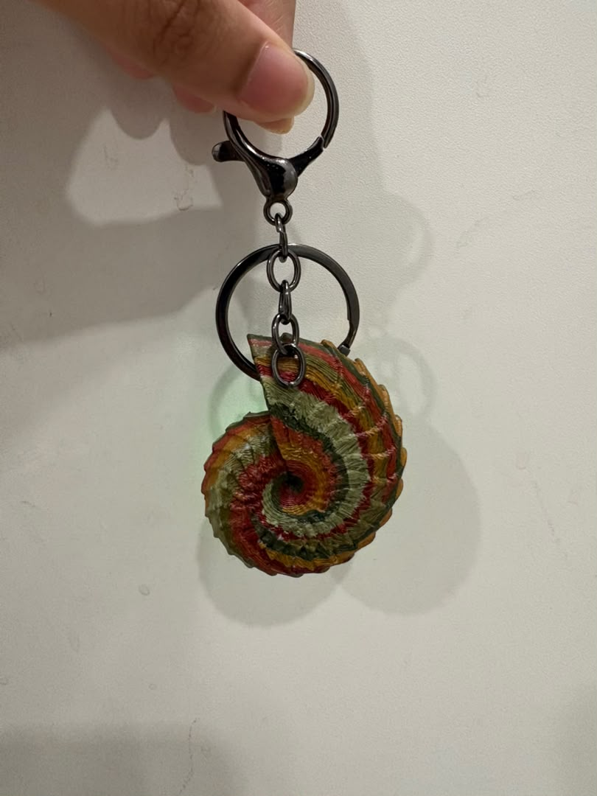

<!-- ~ header wave ~ -->


<p align="center">
  
</p>

<p align="center">
  
  
  
  
</p>

<br />

<table align="center">
  <tr>
    <td align="center"></td>
    <td align="center"></td>
  </tr>
</table>


## 🐚 &nbsp;What is this?

LIQUILLITE is a tiny pendant with a sea of light inside it.

There's an LED matrix behind the glass and an STM32L412 running a FLIP fluid simulation in real time, so the light pools, sloshes and settles like water in a shell. A BMA400 accelerometer tells it which way is down, and a coin cell that charges over USB keeps it running on the go.

I built it because I saw mitxela's fluid pendant, couldn't stop thinking about it, and wanted to make my own from scratch: my own board, my own firmware, my own little enclosure. Everything is open, so if you want one, you can make one.

<br />

<div align="center">


<sub>This project was kindly sponsored by <a href="https://easyeda.com/"><b>EasyEDA</b></a>, who covered the PCB design, manufacturing and prototyping.<br/>
You can explore and fork the full hardware design on <a href="https://oshwlab.com/ezekielchang31/project_aiwnxyiw">OSHWLab</a>.</sub>

</div>


## 🌊 &nbsp;See it move

<p align="center">
  <a href="[https://youtube.com/shorts/2AIkvsZuiDc](https://youtu.be/ThHMOvxxm6c)">
    
  </a>
  <br /><br />
  <a href="https://youtube.com/shorts/2AIkvsZuiDc">
    
  </a>
  <br />
  <sub>or grab the clip straight from the repo: <a href="media/demo.mp4">media/demo.mp4</a></sub>
</p>


## 🫧 &nbsp;Shells & colours

<p align="center"><i>Each one gets its own shade. So far there's amber, emerald and aqua.</i></p>

<table align="center">
  <tr>
    <td align="center"></td>
    <td align="center"></td>
    <td align="center"></td>
  </tr>
  <tr>
    <td align="center" colspan="3"><sub><i>🟠 amber</i></sub></td>
  </tr>
  <tr>
    <td align="center"></td>
    <td align="center"></td>
    <td align="center"></td>
  </tr>
  <tr>
    <td align="center" colspan="2"><sub><i>🟢 emerald</i></sub></td>
    <td align="center"><sub><i>🔵 aqua</i></sub></td>
  </tr>
</table>

<p align="center">
  <br/>
  <sub><i>the enclosure</i></sub>
</p>


## 🪸 &nbsp;How it works

**🧠 The brain.** An STM32L412 reads the accelerometer at a high rate, runs the FLIP simulation (particles carry the fluid, a grid keeps it incompressible) and redraws the LED matrix every frame.

**🧭 The sense of down.** A Bosch BMA400 streams 3-axis acceleration over I²C/SPI. That vector becomes gravity inside the simulation, so the fluid always falls toward the real floor, and tilting, turning or shaking the pendant moves it instantly.

**🔋 The power.** A Microchip MCP73871 power-path charger takes 5V from USB, runs the board and charges the coin cell at the same time, then hands over to the battery when you unplug.

<br />

| | |
|:--|:--|
| **MCU** | STM32L412CBTx |
| **Motion sensor** | Bosch BMA400, ultra-low-power 3-axis accelerometer |
| **Power / charging** | Microchip MCP73871 power-path Li-ion charger |
| **Input** | 5V over USB |
| **Battery** | LIR1654 (16 mm) or LIR2050 (20 mm), 3.6V rechargeable coin cell |
| **Display** | LED matrix |
| **Simulation** | FLIP fluid, following Matthias Müller's method |


## 🛠️ &nbsp;Building your own

The Gerber, BOM and CPL files are on the [OSHWLab page](https://oshwlab.com/ezekielchang31/project_aiwnxyiw). Build from those, since the original design file is missing some traces.

To open the design:

1. Grab [EasyEDA Pro](https://pro.easyeda.com/) (desktop or web).
2. Go to **File → Open → EasyEDA File** and pick `ProDoc_liquilite_.epro2`.
3. Or view, fork, or order boards straight from [OSHWLab](https://oshwlab.com/ezekielchang31/project_aiwnxyiw).

> [!WARNING]
> **Rechargeable cells only.** Use a 3.6V LIR1654 or LIR2050. Never fit a disposable CR2032 or CR1632: the MCP73871 will try to charge it, which can damage the cell or make it leak.

> [!TIP]
> The BMA400 (LGA) and MCP73871 (QFN) are tiny, so use hot air or a fine-tip iron. Before plugging in USB for the first time, check the STM32 and power pins for solder bridges under a magnifier.


## 🗂️ &nbsp;Finding your way around

```
LIQUILLITE/
├── ProDoc_liquilite_.epro2   → PCB + schematic (EasyEDA Pro)
├── liquilite.ioc             → STM32CubeMX configuration
├── Core/                     → firmware source
├── Drivers/                  → STM32 HAL drivers
├── media/                    → photos, renders and the demo clip
└── kicad/                    → KiCAD Archived files
```


## 🤍 &nbsp;Thank you

- **[mitxela](https://mitxela.com/)**, whose fluid pendant started all of this.
- **Matthias Müller**, for the maths behind the FLIP simulation.
- **[EasyEDA](https://easyeda.com/)**, for sponsoring the PCB design, manufacturing and prototyping.

<br />


